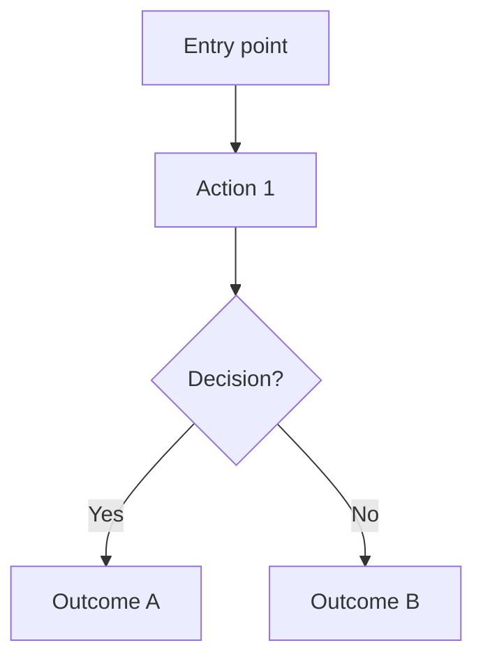

# Design Process

Follow these steps in order. Document outputs as you go.

---

## Step 1 — Analyze Brand & References

If the user provides brand materials:

**For logos:**
- Extract dominant colors → define as brand palette
- Identify style: minimal, bold, geometric, organic, corporate, playful
- Note any existing typography

**For brand manuals / guidelines:**
- Read color system (primary, secondary, neutrals, semantic colors)
- Read typography rules (fonts, weights, scale)
- Read tone and voice (helps determine visual formality)
- Note any explicit DOs and DON'Ts

**For visual references / screenshots:**
- Identify layout patterns (sidebar? top nav? card grid? table?)
- Note color temperature (warm / cool / neutral)
- Note density (compact vs spacious)
- Note visual style (flat, glassmorphism, skeuomorphic, neumorphism)
- Extract the feeling: professional, friendly, minimal, bold

**For website URLs:**
- Analyze the navigation structure
- Identify component vocabulary
- Note the color and typography system

**Output:** Write findings to `docs/design-system.md` before proceeding.

---

## Step 2 — Understand Product Objective

Answer these before designing anything:

1. What is the ONE thing this product helps users accomplish?
2. Who is the primary user? (role, context, tech-savviness)
3. What device do they use? (desktop-first? mobile-first? both?)
4. What emotional state are they in when using this? (rushed? analytical? exploratory?)
5. What does success look like for the user?

---

## Step 3 — Define the User

Create a minimal user profile:

```
User: [role/type]
Goal: [what they want to accomplish]
Context: [when/where they use the product]
Pain points: [what frustrates them currently]
Success: [what good looks like for them]
```

---

## Step 4 — Define UX Flow

Map the critical path — the minimum steps to complete the primary task:



For each screen in the flow, define:
- **Trigger**: what brings the user here
- **Goal**: what the user needs to do
- **Primary action**: the most important CTA
- **Exit**: where they go next

---

## Step 5 — Design the Layout

Use the wireframe template (`wireframe-template.md`) for each screen.

Layout decisions to make explicitly:
- **Navigation pattern**: sidebar / top nav / bottom nav (mobile)
- **Content density**: compact (tables, data) vs spacious (marketing, onboarding)
- **Grid**: how many columns? fixed or fluid?
- **Primary action placement**: top right? floating? inline?
- **Information hierarchy**: what's above the fold?

**Layout principles:**
- One primary action per screen
- Related content grouped with 8px spacing, unrelated with 24px+
- Maximum content width: 1280px for dashboard, 720px for forms
- Sidebar width: 240–280px fixed

---

## Step 6 — Specify Components

For each component in the layout, define:

```
Component: [name]
Purpose: [what it does]
Variants: [default, hover, active, disabled, loading, error]
Props: [configurable parts]
States: [what changes and when]
Accessibility: [keyboard behavior, ARIA, contrast]
```

Reference `ui-patterns.md` for common component decisions.

---

## Step 7 — Accessibility & Responsive Check

**Accessibility checklist:**
- [ ] All text meets WCAG AA contrast (4.5:1 body, 3:1 large text)
- [ ] All interactive elements have keyboard focus states
- [ ] Form inputs have associated labels
- [ ] Error messages are descriptive
- [ ] Images/icons have alt text or aria-hidden if decorative
- [ ] Color is not the only status indicator

**Responsive checklist:**
- [ ] Layout works at 375px (iPhone SE)
- [ ] Layout works at 768px (tablet)
- [ ] Layout works at 1280px (desktop)
- [ ] Navigation adapts (sidebar → bottom nav or hamburger on mobile)
- [ ] Tables are scrollable or transform to cards on mobile
- [ ] Touch targets are 44×44px minimum

---

## Step 8 — Document for Development

Produce a dev-ready spec for each screen:

```markdown
## Screen: [Name]

### Layout
[Description of structure]

### Components
- [Component name]: [variant and state info]

### Spacing
- Section padding: [value]
- Component gap: [value]

### Colors (use tokens, not hex)
- Background: var(--background)
- Primary action: var(--primary)

### Typography
- Heading: text-2xl font-bold
- Body: text-sm text-muted-foreground

### Responsive behavior
- Mobile: [description]
- Desktop: [description]

### Interactions
- [Element]: [what happens on hover/click/focus]
```
