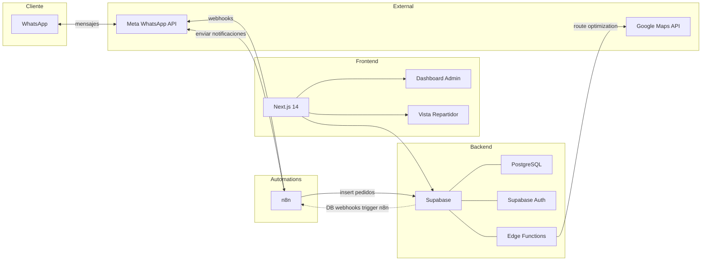
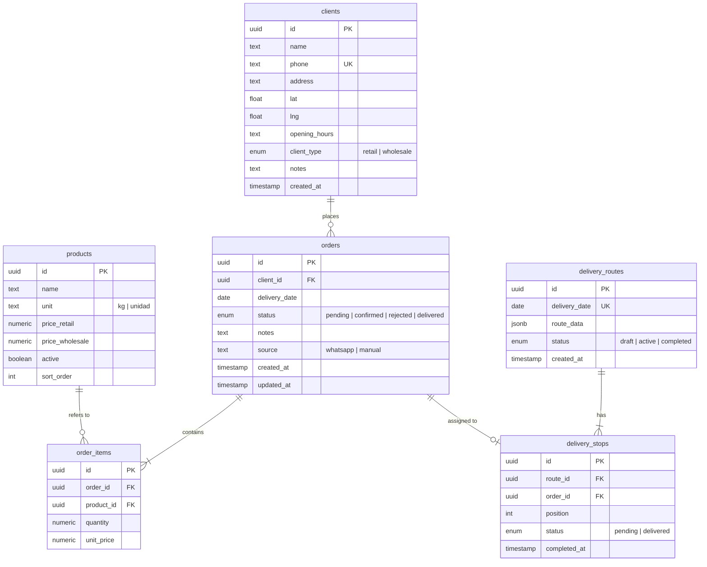

# Architecture: Gestión de Pedidos — Avícola Baccaro

## System Overview

Sistema de tres capas: un bot de WhatsApp orquestado por n8n captura pedidos y los escribe en Supabase (PostgreSQL). Un dashboard web en Next.js permite al admin gestionar pedidos, clientes, productos, estadísticas y logística. Los repartidores acceden a una vista mobile responsive del mismo frontend. Las notificaciones al cliente salen por n8n vía WhatsApp Cloud API.

## Component Diagram

## Tech Stack

| Layer | Technology | Why |
|-------|-----------|-----|
| Frontend | Next.js 14 (App Router) | SSR para dashboard, responsive para mobile. Ecosistema React maduro. |
| UI | Tailwind CSS + shadcn/ui | Componentes accesibles y consistentes sin diseñar desde cero. |
| Database | Supabase (PostgreSQL) | API REST auto-generada, auth integrado, realtime, sin backend custom. |
| Auth | Supabase Auth | Solo usuarios internos (admin/staff). Simple, integrado. |
| Automations | n8n | Flujos visuales para el bot de WhatsApp. Fácil de modificar sin código. |
| WhatsApp | Meta Cloud API (vía n8n) | Canal que los clientes ya usan. |
| Maps | Google Maps API | Distance Matrix + Directions. Cobertura confiable en Argentina. |
| Hosting FE | Vercel | Deploy automático desde git para Next.js. |
| Hosting n8n | Railway o VPS | n8n self-hosted para evitar límites del plan cloud. |

## Data Model

## API Design

Supabase auto-genera la API REST. El frontend usa el SDK de Supabase directamente. Solo se necesitan Edge Functions para lógica compleja.

### Supabase SDK (desde Next.js)

| Resource | Operations | Notes |
|----------|-----------|-------|
| `/clients` | CRUD | Filtro por tipo, búsqueda por nombre/teléfono |
| `/products` | CRUD | Filtro por activo, ordenado por sort_order |
| `/orders` | CRUD | Filtro por fecha, estado. Join con client y order_items |
| `/order_items` | CRU | Siempre en contexto de un order |
| `/delivery_routes` | CR | Una por fecha de entrega |
| `/delivery_stops` | RU | Actualizar status a "delivered" |

### Edge Functions

| Function | Trigger | Purpose |
|----------|---------|---------|
| `optimize-route` | POST manual desde dashboard | Recibe delivery_date, consulta pedidos confirmados, llama a Google Maps Distance Matrix, genera delivery_route con stops ordenados. |
| `production-summary` | GET desde dashboard | Agrega order_items por producto para una fecha. Podría ser un view de Postgres para mejor performance. |
| `order-stats` | GET desde dashboard | Queries de estadísticas: ranking clientes, productos top, tendencias. Podría ser views materializados. |

### n8n Webhooks (recibe desde Supabase)

| Webhook | Trigger | Purpose |
|---------|---------|---------|
| `order-status-changed` | DB webhook on orders.status update | Envía WhatsApp al cliente con confirmación o rechazo. |

### n8n Flows (bot de WhatsApp)

| Flow | Trigger | Purpose |
|------|---------|---------|
| `whatsapp-incoming` | Webhook de Meta | Procesa mensaje del cliente, ejecuta flujo del bot (nuevo pedido / repetir / estado), escribe en Supabase. |

## Integrations

| Service | Purpose | Protocol |
|---------|---------|----------|
| Meta WhatsApp Cloud API | Recibir y enviar mensajes de clientes | Webhooks + REST |
| Google Maps Distance Matrix | Calcular distancias entre paradas para optimizar ruta | REST |
| Google Maps Directions | Generar polyline del recorrido para visualizar en mapa | REST |
| Supabase Realtime | Actualizar dashboard en vivo cuando llegan pedidos | WebSocket |

## Quality Attributes

- **Performance**: Dashboard < 2s carga inicial. Actualización de pedidos en tiempo real vía Supabase Realtime.
- **Security**: Auth solo para usuarios internos (admin, staff). RLS en Supabase para aislar datos. WhatsApp API con token verificado.
- **Availability**: Supabase y Vercel tienen 99.9% uptime. n8n en Railway con auto-restart.
- **Mobile**: Vista repartidor 100% responsive, optimizada para uso en movimiento con una sola mano.
- **Escalabilidad**: 30-50 pedidos/día no requiere optimización especial. El modelo de datos soporta crecimiento sin cambios.

## Key Decisions

### Supabase en vez de backend custom
- **Context**: Se necesita DB, auth, API REST y realtime.
- **Choice**: Supabase cubre todo sin escribir un backend.
- **Tradeoff**: Dependencia del servicio. Lógica compleja va a Edge Functions (vendor lock-in leve).

### n8n para orquestación de WhatsApp
- **Context**: El flujo del bot (preguntar productos, cantidades, confirmar) necesita ser fácil de modificar.
- **Choice**: n8n permite armar flujos visuales sin código.
- **Tradeoff**: Requiere hosting propio. El bot no es conversacional libre (es guiado), lo cual es una ventaja para la adopción.

### Vista responsive en vez de app nativa para repartidores
- **Context**: Los repartidores necesitan ver entregas y marcar como realizadas.
- **Choice**: Vista mobile del mismo Next.js. No app separada.
- **Tradeoff**: Sin acceso offline ni push notifications nativas en v1. Aceptable dado que operan en zona urbana con cobertura.

### Google Maps en vez de alternativas open source (OSRM)
- **Context**: Se necesita calcular rutas optimizadas en Gran Mendoza.
- **Choice**: Google Maps tiene la mejor cobertura y datos de tráfico en Argentina.
- **Tradeoff**: Costo por request. Con 30-50 pedidos/día, el volumen de llamadas a la API es bajo y cae dentro del free tier o costo mínimo.

### Estadísticas con views de Postgres en vez de servicio de analytics
- **Context**: Se necesitan métricas de negocio (ranking clientes, tendencias, etc).
- **Choice**: Views y queries directos sobre Postgres vía Supabase.
- **Tradeoff**: No es un BI completo, pero es suficiente para el volumen y evita agregar herramientas.
